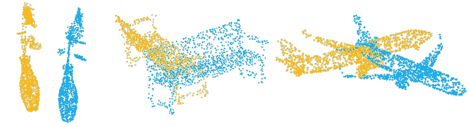

# DeepBBS

## Introduction
This repository contains python scripts for training and testing DeepBBS

## Configuration
System requirments:
- python 3.7
- pytorch=1.5.1
- h5py
- scipy=1.5.0
- scikit-learn=0.23.2
- tqdm

or can be install the environment.yml file:
```shell
conda env create -f environment.yml
```
## Testing
In every test, for testing DeepBBS++ use the argument --DeepBBS_pp=True. For testing DeepBBS use --DeepBBS_pp=False
#### Unseen Point Clouds
Weights can be downloaded from [here](https://drive.google.com/file/d/1-jQX1sJAejKQi_pVU2S3hp4nlv-1VKwX/view?usp=sharing).
```shell
python main.py --n_subsampled_points=768 --DeepBBS_pp=True --model_path=./pretrained/unseen_point_clouds.t7 --eval
```
#### Unseen Categories
Weights can be downloaded from [here](https://drive.google.com/file/d/1igE2iVALsmvR1WP0GkJqltF-uEmvVmLI/view?usp=sharing).
```shell
python main.py --n_subsampled_points=768 --DeepBBS_pp=True --unseen=True --model_path=./pretrained/unseen_categories.t7 --eval
```
#### Gaussian Noise
Weights can be downloaded from [here](https://drive.google.com/file/d/157wCHrl8ENELOY714RI1jLrzgRpRLu5P/view?usp=sharing).
```shell
python main.py --n_subsampled_points 768 --DeepBBS_pp=True --gaussian_noise=True --model_path=./pretrained/gaussian_noise.t7 --eval
```
#### Different Samplings
Weights can be downloaded from [here](https://drive.google.com/file/d/1Wgk4Al_W3k-QFeJPMJNXWj-tJvpty8Q7/view?usp=sharing).
```shell
python main.py --DeepBBS_pp=True --different_pc=True --model_path=./pretrained/different_samplings.t7 --eval
```

## Training
In every case, for training DeepBBS++ use the argument --DeepBBS_pp=True. For training DeepBBS use --DeepBBS_pp=False
#### Unseen Point Clouds
```shell
python main.py --n_subsampled_points=768 --DeepBBS_pp=True --exp_name=unseen_point_clouds
```
#### Unseen Categories
```shell
python main.py --n_subsampled_points=768 --DeepBBS_pp=True --unseen=True --exp_name=unseen_categories
```
#### Gaussian Noise
```shell
python main.py --n_subsampled_points 768 --DeepBBS_pp=True --gaussian_noise=True --exp_name=gaussian_noise
```
#### Different Samplings
```shell
python main.py --DeepBBS_pp=True --different_pc=True --exp_name=different_samplings
```
